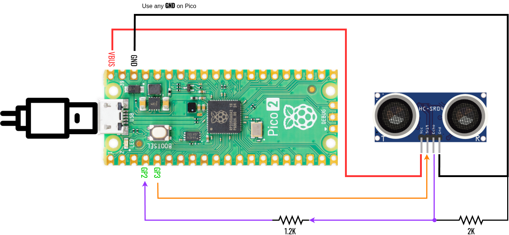
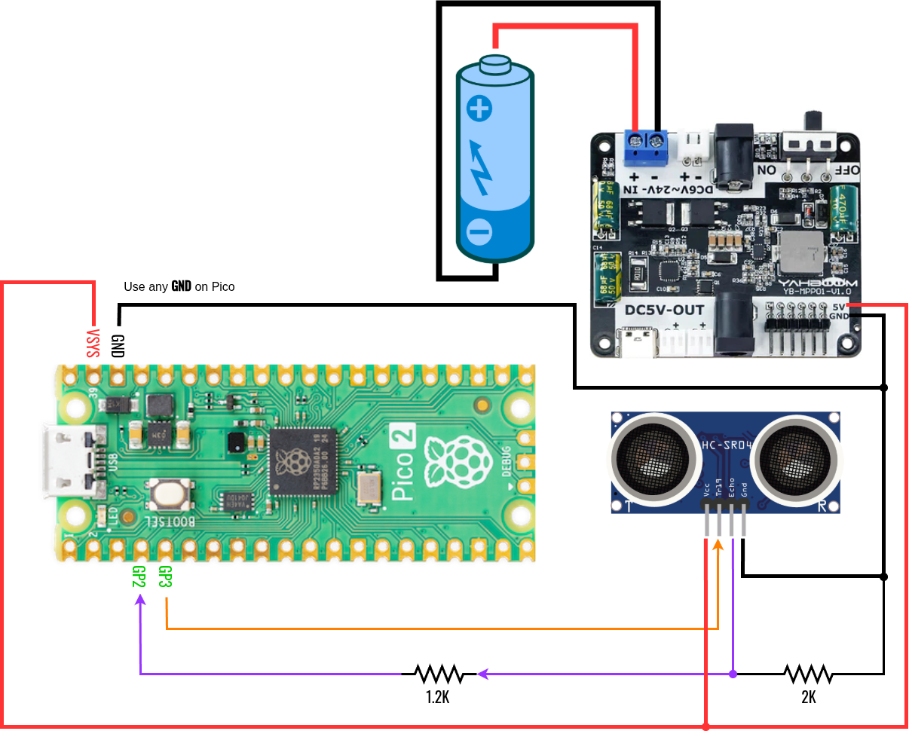

# 3421example-ultrasonic_sensor
[HC-SR04](https://cdn.sparkfun.com/datasheets/Sensors/Proximity/HCSR04.pdf) usage examples 

## 1 Wiring
### 1.1 Powered by Pico's Micro-USB Connection

### 1.2 Powered by External 5V Source (e.g. Buck Converter)
